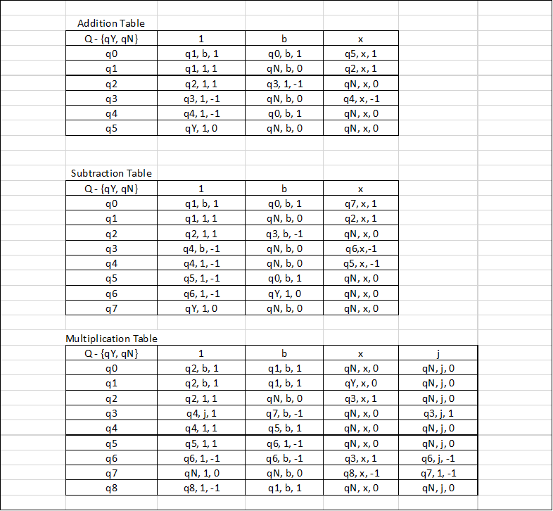

# 605.621 - Algorithms Project 1

#### Introduction
This project implements an algorithm to calculate the closest pair of points
in a set of points. Additionally, this project also implements a deterministic
Turing machine (DTM) class to implement DTMs.

A git repo of the project is at: https://github.com/jmr172/algorithms/tree/master/Project_1

This project was made with Java 8. It can be run from the command line using
the following from within the src directory:
```
$ javac Project1.java && java Project1 ../inputs/input1.txt ../inputs/input2.txt ../output/output1.txt ../output/output2.txt
```

* input1.txt is the input for the closest pairs.
  * input files with 100, 150, 200, and 1000 data points are provided.
* input2.txt is the input for the DTMs.
  * The first line is the input for the provided DTM
  * The second line is the input for the addition DTM
  * The third line is the input for the subtraction DTM
  * The fourth line is the input for the multiplication DTM
* output1.txt contains the output of the closest pairs calculation if necessary
* output2.txt contains the output of the DTM. This will also print to the terminal
if the input size is less than 30 characters.

#### Closest Pairs


#### Deterministic Turing Machine
The instructor provided DTM accepts a tape consisting of 0s, 1s, and bs and
returns halts in a YES state if the two digits before the first b are equal
to 0.

Here is a successful run with input and each transition:
```
Running provided DTM...
1100b
1100b
1100b
1100b
1100b
1100b
110bb
11bbb
DTM ended in a YES state.
```

Here is an unsuccessful run with input and each transition:
```
Running provided DTM...
101b
101b
101b
101b
101b
10bb
1bbb
DTM ended in a No state.
```



Next, I designed and implemented a DTM that would accept and perform addition on a
tape containing two unary numbers separated by an x. The addition table in the above
figure displays my transitions.

I find a 1 and convert it to a blank.
Next, I find the x.
Then, I find the next b, and convert it to a 1.
Next, I return to the first b. Repeat steps 1-4 until there are no more 1's
left of the x.

Here is a successful run with padded input and each transition:
```
Running unary addition DTM...
11x111bbbbbbbb
b1x111bbbbbbbb
b1x111bbbbbbbb
b1x111bbbbbbbb
b1x111bbbbbbbb
b1x111bbbbbbbb
b1x111bbbbbbbb
b1x1111bbbbbbb
b1x1111bbbbbbb
b1x1111bbbbbbb
b1x1111bbbbbbb
b1x1111bbbbbbb
b1x1111bbbbbbb
b1x1111bbbbbbb
bbx1111bbbbbbb
bbx1111bbbbbbb
bbx1111bbbbbbb
bbx1111bbbbbbb
bbx1111bbbbbbb
bbx1111bbbbbbb
bbx11111bbbbbb
bbx11111bbbbbb
bbx11111bbbbbb
bbx11111bbbbbb
bbx11111bbbbbb
bbx11111bbbbbb
bbx11111bbbbbb
bbx11111bbbbbb
bbx11111bbbbbb
DTM ended in a YES state.
```

Here is an unsuccessful run with padded input and each transition:
```
Running unary addition DTM...
1x1x111bbbbbbbbb
bx1x111bbbbbbbbb
bx1x111bbbbbbbbb
bx1x111bbbbbbbbb
bx1x111bbbbbbbbb
DTM ended in a No state.
```

Next, I designed and implemented a DTM that would accept and perform subtraction on a
tape containing two unary numbers separated by an x. The subtraction table in the above
figure displays my transitions.

I find a 1 and convert it to a blank.
Next, I find the x.
Then, I find the first b to the right of the 1's. I go back one space and convert that 1 to a b.
Next, I return to the first b. Repeat steps 1-4 until there are no more 1's
left of the x.

Here is a successful run with input and each transition:
```
Running unary subtraction DTM...
11x111b
b1x111b
b1x111b
b1x111b
b1x111b
b1x111b
b1x111b
b1x111b
b1x11bb
b1x11bb
b1x11bb
b1x11bb
b1x11bb
b1x11bb
bbx11bb
bbx11bb
bbx11bb
bbx11bb
bbx11bb
bbx1bbb
bbx1bbb
bbx1bbb
bbx1bbb
bbx1bbb
bbx1bbb
DTM ended in a YES state.
```

Here is an unsuccessful run with input and each transition:
```
Running unary subtraction DTM...
11xx111b
b1xx111b
b1xx111b
b1xx111b
b1xx111b
DTM ended in a No state.
```

Next, I designed and implemented a DTM that would accept and perform multiplication on a
tape containing two unary numbers separated by an x. The multiplication table in the above
figure displays my transitions.

1. I find a 1 and convert it to a blank.
2. Next, I find the x.
3. Then, I find the first 1 to the right of the x. I convert it to a temporary character 'j' for James.
4. Then, I find the first b to the right of the 1's.
5. Next, I find the next b and convert it to a 1.
6. I return to the x.
7. Return to 3. If no 1's are found, go to 8.
8. Convert all j's back to 1's and return to the first b on the left.
9. Repeat 1-8 until no more 1's are left of the x. The answer will be the bits appended to the input.

Here is a successful run with input and each transition:
```
Running unary multiplication DTM...
11x11bbbbbbbbbbbbbbbbbbbbbbbbbbbbbbbbbbbbb
b1x11bbbbbbbbbbbbbbbbbbbbbbbbbbbbbbbbbbbbb
b1x11bbbbbbbbbbbbbbbbbbbbbbbbbbbbbbbbbbbbb
b1x11bbbbbbbbbbbbbbbbbbbbbbbbbbbbbbbbbbbbb
b1xj1bbbbbbbbbbbbbbbbbbbbbbbbbbbbbbbbbbbbb
b1xj1bbbbbbbbbbbbbbbbbbbbbbbbbbbbbbbbbbbbb
b1xj1bbbbbbbbbbbbbbbbbbbbbbbbbbbbbbbbbbbbb
b1xj1b1bbbbbbbbbbbbbbbbbbbbbbbbbbbbbbbbbbb
b1xj1b1bbbbbbbbbbbbbbbbbbbbbbbbbbbbbbbbbbb
b1xj1b1bbbbbbbbbbbbbbbbbbbbbbbbbbbbbbbbbbb
b1xj1b1bbbbbbbbbbbbbbbbbbbbbbbbbbbbbbbbbbb
b1xj1b1bbbbbbbbbbbbbbbbbbbbbbbbbbbbbbbbbbb
b1xj1b1bbbbbbbbbbbbbbbbbbbbbbbbbbbbbbbbbbb
b1xjjb1bbbbbbbbbbbbbbbbbbbbbbbbbbbbbbbbbbb
b1xjjb1bbbbbbbbbbbbbbbbbbbbbbbbbbbbbbbbbbb
b1xjjb1bbbbbbbbbbbbbbbbbbbbbbbbbbbbbbbbbbb
b1xjjb11bbbbbbbbbbbbbbbbbbbbbbbbbbbbbbbbbb
b1xjjb11bbbbbbbbbbbbbbbbbbbbbbbbbbbbbbbbbb
b1xjjb11bbbbbbbbbbbbbbbbbbbbbbbbbbbbbbbbbb
b1xjjb11bbbbbbbbbbbbbbbbbbbbbbbbbbbbbbbbbb
b1xjjb11bbbbbbbbbbbbbbbbbbbbbbbbbbbbbbbbbb
b1xjjb11bbbbbbbbbbbbbbbbbbbbbbbbbbbbbbbbbb
b1xjjb11bbbbbbbbbbbbbbbbbbbbbbbbbbbbbbbbbb
b1xjjb11bbbbbbbbbbbbbbbbbbbbbbbbbbbbbbbbbb
b1xjjb11bbbbbbbbbbbbbbbbbbbbbbbbbbbbbbbbbb
b1xj1b11bbbbbbbbbbbbbbbbbbbbbbbbbbbbbbbbbb
b1x11b11bbbbbbbbbbbbbbbbbbbbbbbbbbbbbbbbbb
b1x11b11bbbbbbbbbbbbbbbbbbbbbbbbbbbbbbbbbb
b1x11b11bbbbbbbbbbbbbbbbbbbbbbbbbbbbbbbbbb
b1x11b11bbbbbbbbbbbbbbbbbbbbbbbbbbbbbbbbbb
bbx11b11bbbbbbbbbbbbbbbbbbbbbbbbbbbbbbbbbb
bbx11b11bbbbbbbbbbbbbbbbbbbbbbbbbbbbbbbbbb
bbxj1b11bbbbbbbbbbbbbbbbbbbbbbbbbbbbbbbbbb
bbxj1b11bbbbbbbbbbbbbbbbbbbbbbbbbbbbbbbbbb
bbxj1b11bbbbbbbbbbbbbbbbbbbbbbbbbbbbbbbbbb
bbxj1b11bbbbbbbbbbbbbbbbbbbbbbbbbbbbbbbbbb
bbxj1b11bbbbbbbbbbbbbbbbbbbbbbbbbbbbbbbbbb
bbxj1b111bbbbbbbbbbbbbbbbbbbbbbbbbbbbbbbbb
bbxj1b111bbbbbbbbbbbbbbbbbbbbbbbbbbbbbbbbb
bbxj1b111bbbbbbbbbbbbbbbbbbbbbbbbbbbbbbbbb
bbxj1b111bbbbbbbbbbbbbbbbbbbbbbbbbbbbbbbbb
bbxj1b111bbbbbbbbbbbbbbbbbbbbbbbbbbbbbbbbb
bbxj1b111bbbbbbbbbbbbbbbbbbbbbbbbbbbbbbbbb
bbxj1b111bbbbbbbbbbbbbbbbbbbbbbbbbbbbbbbbb
bbxj1b111bbbbbbbbbbbbbbbbbbbbbbbbbbbbbbbbb
bbxjjb111bbbbbbbbbbbbbbbbbbbbbbbbbbbbbbbbb
bbxjjb111bbbbbbbbbbbbbbbbbbbbbbbbbbbbbbbbb
bbxjjb111bbbbbbbbbbbbbbbbbbbbbbbbbbbbbbbbb
bbxjjb111bbbbbbbbbbbbbbbbbbbbbbbbbbbbbbbbb
bbxjjb111bbbbbbbbbbbbbbbbbbbbbbbbbbbbbbbbb
bbxjjb1111bbbbbbbbbbbbbbbbbbbbbbbbbbbbbbbb
bbxjjb1111bbbbbbbbbbbbbbbbbbbbbbbbbbbbbbbb
bbxjjb1111bbbbbbbbbbbbbbbbbbbbbbbbbbbbbbbb
bbxjjb1111bbbbbbbbbbbbbbbbbbbbbbbbbbbbbbbb
bbxjjb1111bbbbbbbbbbbbbbbbbbbbbbbbbbbbbbbb
bbxjjb1111bbbbbbbbbbbbbbbbbbbbbbbbbbbbbbbb
bbxjjb1111bbbbbbbbbbbbbbbbbbbbbbbbbbbbbbbb
bbxjjb1111bbbbbbbbbbbbbbbbbbbbbbbbbbbbbbbb
bbxjjb1111bbbbbbbbbbbbbbbbbbbbbbbbbbbbbbbb
bbxjjb1111bbbbbbbbbbbbbbbbbbbbbbbbbbbbbbbb
bbxjjb1111bbbbbbbbbbbbbbbbbbbbbbbbbbbbbbbb
bbxj1b1111bbbbbbbbbbbbbbbbbbbbbbbbbbbbbbbb
bbx11b1111bbbbbbbbbbbbbbbbbbbbbbbbbbbbbbbb
bbx11b1111bbbbbbbbbbbbbbbbbbbbbbbbbbbbbbbb
bbx11b1111bbbbbbbbbbbbbbbbbbbbbbbbbbbbbbbb
bbx11b1111bbbbbbbbbbbbbbbbbbbbbbbbbbbbbbbb
DTM ended in a YES state.
```

Here is an unsuccessful run with input and each transition:
```
Running unary multiplication DTM...
11x1x1bbbbbbbbbbbbbbbbbbbbbbbbbbbbbbbbbbbbbbbbbbbbbbbbbb
b1x1x1bbbbbbbbbbbbbbbbbbbbbbbbbbbbbbbbbbbbbbbbbbbbbbbbbb
b1x1x1bbbbbbbbbbbbbbbbbbbbbbbbbbbbbbbbbbbbbbbbbbbbbbbbbb
b1x1x1bbbbbbbbbbbbbbbbbbbbbbbbbbbbbbbbbbbbbbbbbbbbbbbbbb
b1xjx1bbbbbbbbbbbbbbbbbbbbbbbbbbbbbbbbbbbbbbbbbbbbbbbbbb
b1xjx1bbbbbbbbbbbbbbbbbbbbbbbbbbbbbbbbbbbbbbbbbbbbbbbbbb
DTM ended in a No state.
```
